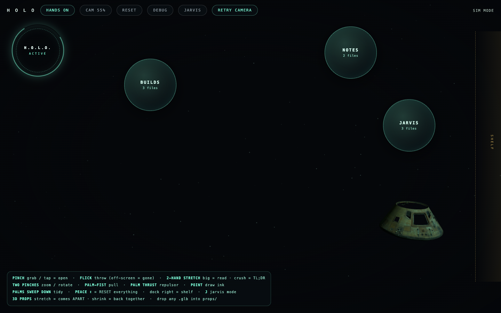

# ✋ HOLO — Control Your Notes With Your Bare Hands


*Your notes as floating orbs, a real Apollo 11 capsule scan on the shelf — all controlled by your bare hands.*

Turn your webcam into an **Iron Man interface for your markdown notes**. Folders float as orbs
over your own mirrored video. You pinch files out of the air, throw them with real momentum,
crush a note between two hands and an AI voice reads you the gist.

Everything runs **on your machine**. No cloud, no API keys, no accounts, no sign-up.
Camera frames never leave the page.

> The hand tracking is Google MediaPipe (Apache-2.0), **self-hosted inside this repo** —
> so ad-blockers, CDN outages, and offline machines can't break it.

---

## ⚡ Install (one command)

```bash
git clone https://github.com/zubair-trabzada/holo-gestures.git ~/holo && cd ~/holo && python3 server.py
```

Then open **http://localhost:4890** in Chrome, allow the camera, and raise a hand. That's it.

Python 3 is the only requirement (standard library only — nothing to `pip install`).

> Already installed? Update with:
> ```bash
> cd ~/holo && git pull && python3 server.py
> ```

---

## 🖐 The gestures

| Do this | Get this |
|---|---|
| **Pinch** a card | grab it, drag it, throw it with real momentum |
| **Quick pinch** (a tap) | an orb fans out its files · a note opens in the reader |
| **Flick** a note off-screen | it evaporates (reopen its orb to bring it back) |
| **Two pinches**, apart / together | zoom the whole scene · twist to rotate it |
| **Two-hand stretch** on a held card | pull big to read it · crush small for a spoken summary |
| **Peace sign ✌** held | resets everything to its original place — a refresh without the refresh |
| Drag to the **right edge** | docks the card on the shelf |
| Press **F** | EFFECTS: palm-hold repulsor · palm→fist force-pull · point to draw ink · clap · two-palm tidy |
| Press **J** | JARVIS mode — the deck goes gold and a local voice narrates what your hands do |

An on-screen legend shows all of it while you play. A pinch means your thumb and finger
**actually touch** — near-misses are ignored on purpose.

---

## 🦴 3D props — drop in any model

Two real **Smithsonian** scans ship with it, both public domain: the **Apollo 11 Command
Module** (the actual Columbia, scorch marks and all) and a **Triceratops** skeleton.

Grab one and twist your wrist to spin it. **Stretch it bigger with two hands and it comes
apart** — the closer you zoom, the further the pieces separate. Shrink it and it fuses back
together. Even single-mesh scans get sliced into shards at load, so *everything* opens up.

Drop any `.glb` into `props/` and it appears on the deck:

```
props/
  apollo-11-module.glb
  triceratops.glb
  your-model-here.glb     ← any .glb works
```

If a downloaded model refuses to load it's usually Draco-compressed. Decompress it once:

```bash
npx @gltf-transform/cli copy in.glb out.glb
```

---

## 📁 Point it at your own notes

Edit `holo.json`:

```json
{"folder": "/path/to/your/notes"}
```

Subfolders become orbs, files become the cards you pinch out of the air. It ships pointed at
`sample-notes/` so it works the second you run it.

---

## 🛠 Make it yours

It's one readable HTML file plus a small Python server, MIT licensed. Every gesture threshold
is a named constant near the top of `holo.html` (`PINCH_IN`, `PINCH_OUT`, `PINCH_EARN`, `AMP`).

- `?sim=1` — a scripted demo plays with synthetic hands, no camera needed
- `?probe=1` — the built-in test battery runs the real engine on synthetic frames (**26/26**)
- `HOLO_PORT=4891 python3 server.py` — run it on another port
- The mouse works as a fallback everywhere

Change something, then run `?probe=1` and make sure it still says 26/26. That's the whole
workflow.

---

## 🚀 Want to go further?

This deck is the **hands**. It came out of building **JARVIS** — an AI second brain with a 3D
galaxy of every note you own that you steer with these same gestures, a voice you talk to that
answers from your notes, phone calls it makes on your behalf, email and calendar, a
computer-takeover mode, and eyes that can see you.

**Join the free AI Workshop community** for the walkthroughs, the prompt packs, and every build
like this one:

### 👉 [skool.com/aiworkshop-lite](https://www.skool.com/aiworkshop-lite)

Watch it get built: [youtube.com/@mygptworkshop](https://www.youtube.com/@mygptworkshop)

---

## 📄 License

Original code: **MIT** (see `LICENSE`).

`vendor/` contains Google MediaPipe Tasks Vision (Apache-2.0) and three.js incl. GLTFLoader
(MIT), self-hosted so nothing breaks offline. Note: both `vendor/wasm/vision_wasm_*.js` files
carry a one-line shim at the top (marked `HOLO SHIM`) that fixes a crash in MediaPipe's
released wasm glue — if you re-download MediaPipe yourself, re-apply it.

The models in `props/` are Smithsonian Institution 3D digitizations (Apollo 11 Command Module,
Triceratops horridus), released **CC0** at [3d.si.edu](https://3d.si.edu).
